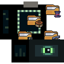

# Bedrock Dev Icons

<div align="center">
  
  
  **Finally, a VS Code that speaks Minecraft! 🎮**
  
  [](https://github.com/keyyard/bedrock-dev-icons)
  [](https://code.visualstudio.com/)
  [](LICENSE)
</div>

---

**Tired of boring folder icons when developing Minecraft addons?** Your workspace should feel as exciting as the worlds you're creating! 

Transform your development experience with pixelated icons that make navigating your addon structure feel like exploring a Minecraft world. **No more guessing which folder contains what** - every BP and RP folder now has its own distinctive, beautiful pixelated icon that instantly tells you its purpose.

## 🚀 Why Your Development Life Just Got Better

### 💡 **Stop Wasting Time Searching for Files**
Before: *"Was it in `entities` or `entity`? Let me check 5 different folders..."*  
**After: One glance and you know exactly where everything is.** Each folder type has its own unique pixelated icon that screams its purpose from across the room.

### 🎯 **Feel Like You're Building in Minecraft**
**Your code editor should match your creative energy!** Every time you open VS Code, you'll feel the same excitement as launching Minecraft. Your workspace becomes an extension of the blocky worlds you're creating.

### 🧠 **Reduce Mental Fatigue**
**Stop burning mental energy on navigation.** When every folder looks different, your brain instantly recognizes patterns. Spend less time hunting for files and more time actually creating awesome addons.

### ⚡ **Keep Everything You Love About VS Code**
**We didn't mess with perfection.** All your familiar file icons (JavaScript, TypeScript, JSON, Python, etc.) stay exactly the same. You get the best of both worlds - Minecraft magic for folders, VS Code excellence for files.

## � What Changes in Your Daily Workflow

### Before Bedrock Dev Icons:
```
📁 animations          👀 "Is this BP or RP animations?"
📁 entities            🤔 "Wait, which pack am I in?"
📁 items               😵 "Are these behavior or resource items?"
📁 functions           ⏰ Time wasted navigating
```

### After Bedrock Dev Icons:
```
🎬 animations          ⚡ Instantly recognizable
🎭 entities            🎯 Purpose crystal clear  
🎒 items               😊 Navigation becomes intuitive
📜 functions           🚀 Productivity through the roof
```

### 🔥 **Real Developer Benefits You'll Notice Immediately**

**Day 1:** *"Wow, I can actually tell my folders apart!"*  
**Week 1:** *"I'm navigating my addons 3x faster than before"*  
**Month 1:** *"I can't imagine developing without these icons"*

## 💰 **The Complete Package - Zero Compromises**

**You're not just getting folder icons** - you're getting a complete icon theme that:

- ✅ **Recognizes 50+ file types** with their standard VS Code icons
- ✅ **Seamlessly integrates** with your existing workflow  
- ✅ **Works on any project** - not just Minecraft addons
- ✅ **Performs flawlessly** with zero impact on VS Code speed
- ✅ **Looks gorgeous** in both light and dark themes

**It's like having a professional designer customize your entire workspace** - but it takes 30 seconds to install.

## � Installation - Get Started in 30 Seconds

### � **From VS Code Marketplace** (Recommended)
1. **Open VS Code** → Extensions (`Ctrl+Shift+X`)
2. **Search** for "Bedrock Dev Icons" by keyyard
3. **Click Install** → **Activate** in File Icon Theme
4. **Start creating!** Your workspace is now Minecraft-ready ⚡

### 📦 **Manual Installation** (For Early Access)
1. **Download** the latest `.vsix` from [Releases](https://github.com/keyyard/bedrock-dev-icons/releases)
2. **Install** with `Extensions: Install from VSIX` (Ctrl+Shift+P)
3. **Activate** in File Icon Theme settings
4. **Enjoy** your new development paradise! 🎮

## 🎲 See It In Action

**Your typical Bedrock addon structure will transform from this:**
```
📁 BP/
  📁 animations
  📁 entities  
  📁 items
  📁 functions
```

**To this visual feast:**
```
🎮 BP/
  🎬 animations      ← Instantly recognizable
  🎭 entities        ← Purpose crystal clear
  🎒 items          ← Navigation becomes intuitive  
  📜 functions      ← Find what you need fast
```

**Plus every other file type you work with keeps its familiar VS Code icon** - JavaScript, TypeScript, JSON, Python, CSS, HTML, and 50+ others work exactly as before.

## 🌟 What Developers Are Saying

> *"Finally! No more opening 5 different folders to find my entity files. This saves me hours every week."*  
> **— MinecraftModder2024**

> *"My workspace actually looks like I'm building something awesome now. It makes coding feel fun again!"*  
> **— BedrockBuilder_Pro**

> *"I was skeptical about icon themes, but this one actually makes me more productive. The visual clarity is incredible."*  
> **— AddonDeveloper**

## 🎉 What's New in v0.0.2 - The Game Changer

**From "nice folder icons" to "can't live without it":**

- 🔥 **Complete Icon Theme**: Now works as your primary icon theme for ANY project
- ⚡ **Lightning Fast Navigation**: 35+ custom Bedrock folder icons + all VS Code defaults
- 🎯 **Zero Learning Curve**: Familiar file icons stay exactly the same
- 🚀 **Performance Optimized**: Faster loading, smoother experience
- 💎 **Professional Polish**: Every detail refined for the best developer experience

## 🤝 Join the Community

**Love what you see? Help make it even better!**

### 🎨 **Add Your Creative Touch**
Missing an icon for your unique addon structure? We want to hear from you! Every contribution makes the entire Bedrock community more productive.

### 🚀 **Quick Start for Contributors**
```bash
git clone https://github.com/keyyard/bedrock-dev-icons.git
cd bedrock-dev-icons
npm install
npm run build    # See your changes instantly!
```

### 💡 **Ways to Contribute**
- **� Design new icons** for missing folder types
- **🐛 Report issues** you encounter in your workflow  
- **💬 Suggest improvements** based on your development experience
- **⭐ Star the repo** to help other developers discover it
- **📢 Share with friends** who develop Bedrock addons

### 🎯 **Icon Design Made Simple**
- **Format**: PNG, 32x32 pixels for crisp display
- **Style**: Pixelated Minecraft aesthetic (we'll help you nail it!)
- **Testing**: We provide tools to see how your icons look instantly
- **Support**: Friendly community ready to help with design questions

**Every icon you contribute helps thousands of developers work more efficiently.** Your 30 minutes of design work could save the community hundreds of hours of navigation time!

---

<div align="center">

## 💎 **Ready to Transform Your Development Experience?**

**⬇️ Install now and feel the difference in your next coding session ⬇️**

[](https://marketplace.visualstudio.com/items?itemName=keyyard.bedrock-dev-icons)

**Made with ❤️ by developers, for developers**

*Transform your VS Code into a pixelated paradise! 🎮✨*

</div>
3. **🎨 Add** your icons to `icons/BP/` or `icons/RP/` 
4. **⚙️ Update** `icon-theme.json` to include your new icons
5. **✅ Test** your changes with `npm run build`
6. **📝 Commit** your changes (`git commit -m 'Add amazing new icons'`)
7. **🚀 Push** to the branch (`git push origin feature/amazing-icons`)
8. **📬 Submit** a pull request

### Icon Guidelines

- **📐 Format**: PNG format, 32x32 pixels recommended
- **🎮 Style**: Pixelated aesthetic consistent with Minecraft
- **🌗 Contrast**: Ensure visibility in both light and dark themes
- **📁 Naming**: Use lowercase with underscores (e.g., `my_folder.png`)
- **🎯 Purpose**: Icons should clearly represent their folder's function

### Requesting New Icons

Missing an icon for your addon structure? [Open an issue](https://github.com/keyyard/bedrock-dev-icons/issues/new) with:
- 📝 Folder name and purpose
- 🎯 Usage context in Bedrock development  
- 🎨 Design suggestions (optional)

## 📋 Version History

### v0.0.2 (Latest) - Complete Icon Theme
- ✅ Added VS Code default file icons integration
- ✅ Enhanced support for 50+ file types
- ✅ Complete icon theme experience

### v0.0.1 - Initial Release
- 🎮 35+ custom pixelated folder icons
- 📁 Behavior Pack (BP) and Resource Pack (RP) support
- 🎯 Folder-only icon theme

## 📄 License

This project is licensed under the **MIT License** - see the [LICENSE](LICENSE) file for details.

## 📞 Support & Community

<div align="center">

### Need Help?

| **Issue Tracker** | **Discord Support** | **Direct Contact** |
|:-----------------:|:-------------------:|:------------------:|
| [🐛 Report Bugs](https://github.com/keyyard/bedrock-dev-icons/issues) | 💬 Message me: Keyyard | [📧 Email Support](mailto:contact@keyyard.xyz) |

</div>

### Quick Links
- 🚀 **[Latest Release](https://marketplace.visualstudio.com/items?itemName=keyyard.bedrock-dev-icons)**
- 📝 **[Changelog](CHANGELOG.md)**
- 🔧 **[Development Setup](SETUP_COMPLETE.md)**
- 🧪 **[Testing Guide](TESTING.md)**
- 🌐 **[Visit My Website](https://keyyard.xyz)**

---

<div align="center">

**Made with ❤️ for the Minecraft Bedrock development community**

[](https://github.com/keyyard/bedrock-dev-icons/stargazers)
[](https://github.com/keyyard/bedrock-dev-icons/network/members)

*Transform your VS Code into a pixelated Minecraft paradise! 🎮*

</div>
